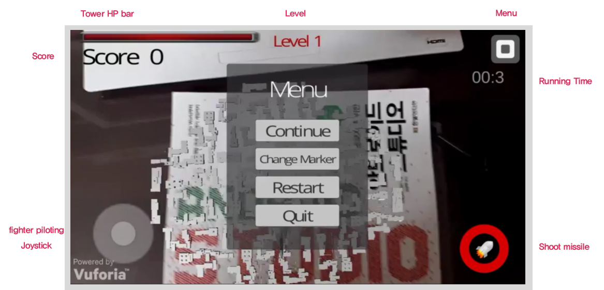
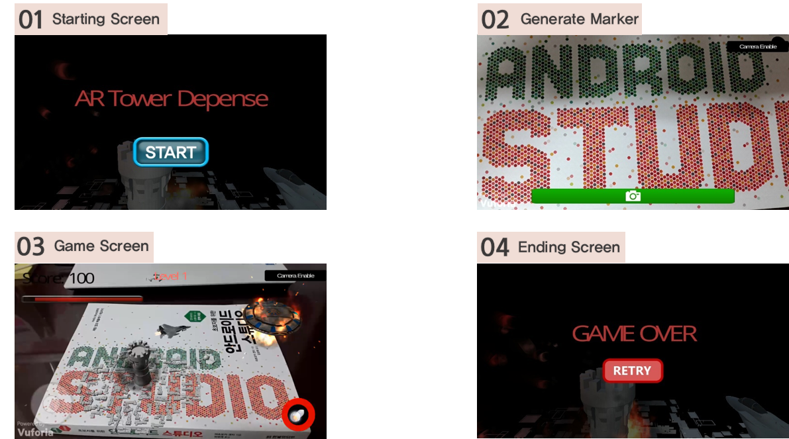

# AR Tower Defence (mobile android ver) 
  
  

     

  
  
## Introduction  
  
  
>This project was coded in 2016 for mobile software design course final project. You can enjoy an AR game without **appointed marker**. You can make any flat parts to marker by taking a picture. If the region has many obvious features, it's really good.  
  
  
## Environment  

     

  
  
  
#### software  
  
>Windows 8.1(x64), Unity3D 5.3, Vuforia
>Moblie os : Android 5.0  
 
#### hardware  
  
>CPU : i3-4005U 1.72GHz, Memory : 6GB
>moblie device : SAMSUNG GALAXY ALPHA  
  
  
## Screen form

     

## Game Process  
  

     

Before starting this game, we should make marker. Any flat place is ok if there are some features. If capture a marker region, the game start. You have to defend the tower from other fighters. You should shoot the enemy down before they attack our tower. The enemy's speed will be up as time goes by. If the tower's HP becomes zero, the game is over.

## Piloting    
  

     

  

We can control our fighter by moving a joystick on the lower left of the screen.  
  
  
## Shooting Missile  
    

     

  
I limited the number of missiles. A lot of missiles give rise to wreck. So I removed the missile if it goes over a threshold.  
  
  
## Explosion    
  

     

for a natural explosion effect, I refered to [this site](https://www.youtube.com/watch?v=BHdbBtGgfb8)
  
  
## Items  
  

     

I added some other functions like item. 
  
  
## Result  
  
  
[click for full video](https://www.youtube.com/watch?v=Bg8MN11C63I)  

